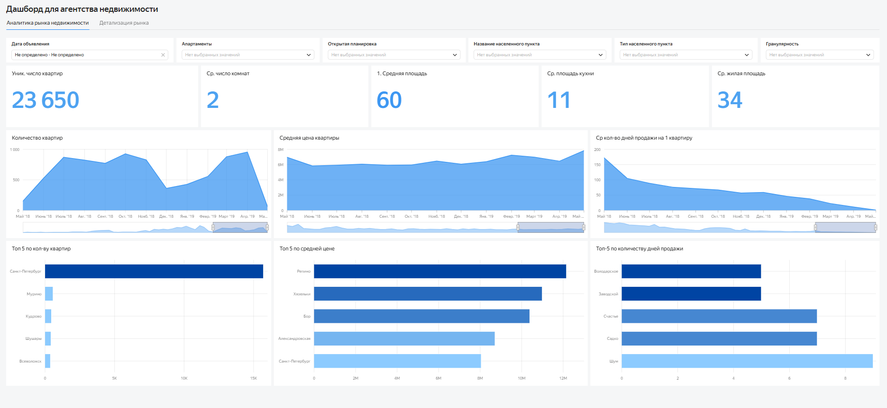

# sql-real-estate-analysis
Проект по анализу рынка недвижимости
# Анализ рынка недвижимости

## Задача
Исследовать рынок недвижимости Санкт-Петербурга и Ленинградской области.

## Используемые инструменты
- SQL
- PostgreSQL
- DataLens

## Что было сделано
- Очистка данных
- Анализ сезонности
- Анализ факторов скорости продажи

## Основные выводы
- Больше всего объявлений о продаже недвижимости появляется осенью, особенно в сентябре–ноябре. Также есть небольшой всплеск в феврале. Меньше всего активность в январе, мае, апреле и декабре. То есть продавцы в основном выходят на рынок осенью, а в праздничные и летние периоды активность снижается. Снятие объявлений с публикации тоже чаще всего приходится на осень и начало года — в октябре, ноябре, сентябре, а также в январе и декабре. Это говорит о том, что основное число сделок происходит в те же периоды.
- Цена за квадратный метр почти не зависит от сезона. Разброс небольшой, в пределах примерно 5–8 процентов, поэтому выраженной сезонности здесь нет. Немного выше цены встречаются в январе и сентябре, а ниже — весной и в ноябре, но это скорее локальные колебания.
- В обоих регионах чаще всего встречаются объявления, которые находятся в продаже больше полугода. При этом чем дольше квартира продаётся, тем обычно она больше по площади и количеству комнат.
## Сезонность публикаций

